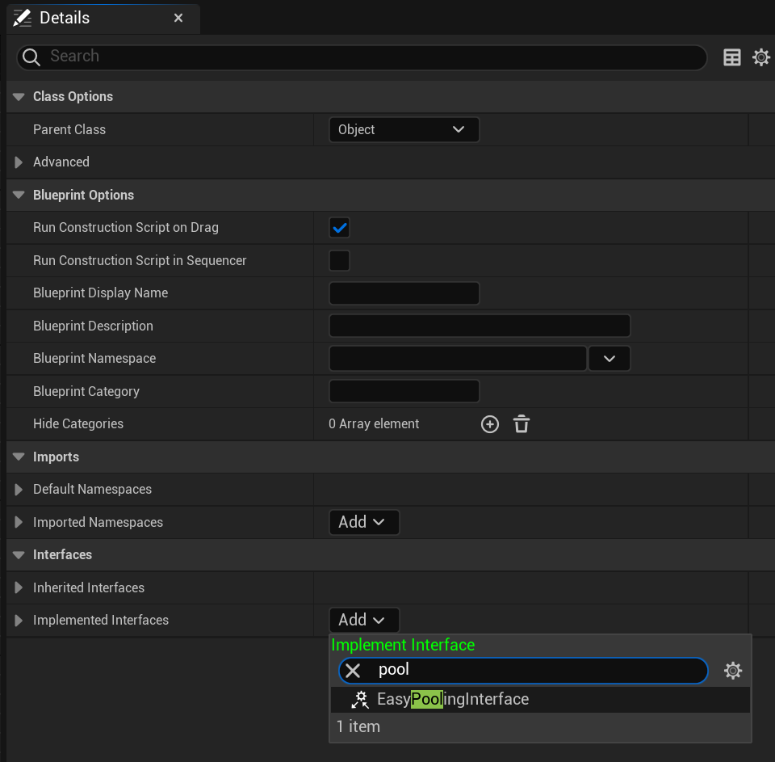
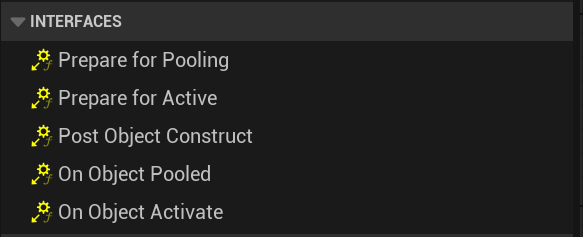
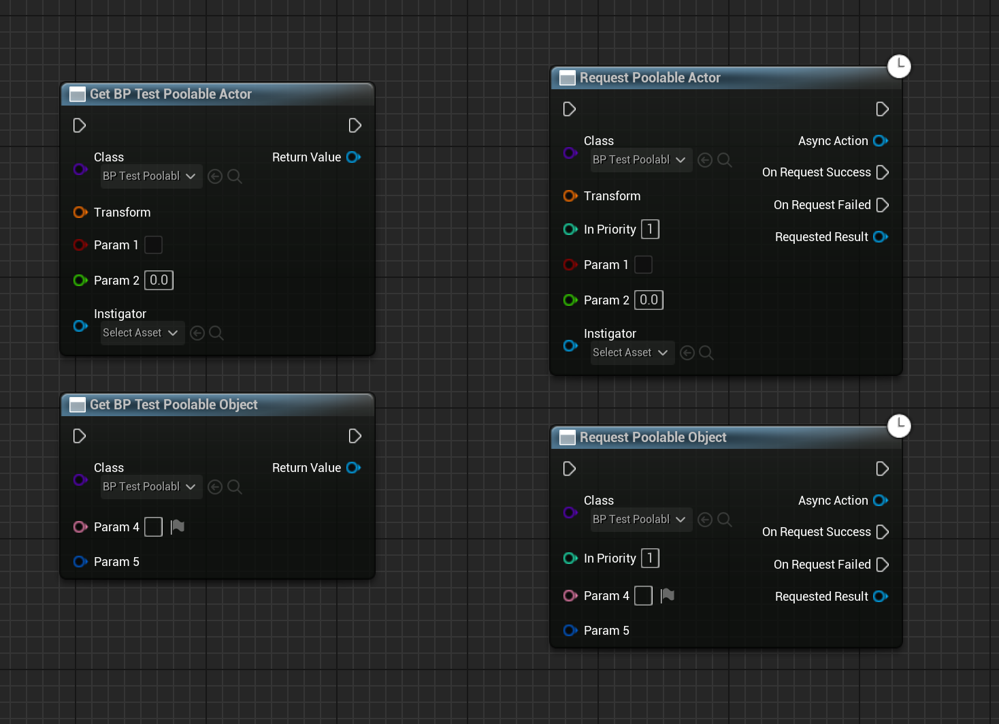
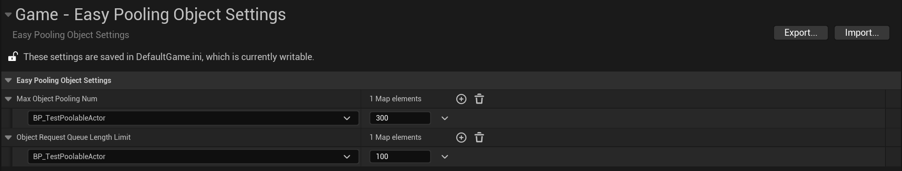

# 简单对象池
- 支持蓝图、C++
- 支持设置对象池最大数量
- 支持对象池满后异步等待获取对象
- 支持设置异步等待优先级，支持设置队列上限
- 封装为 UK2Node，保持了类似于 Construct Object 的快速设置 ExposeOnSpawn 变量的引脚

## 快速使用
1. 继承接口
   

   
   

2. 重载相关函数
   

   
   

3. 通过接口获取对象
   

   
   

## 其他
- 设置对象池数量上限和等待队列上限
   

   
   

